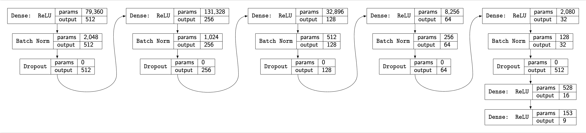

# Deep Learning Tools for Rocket League
## BallsNet

  

- Takes in group data and predicts the rank of players in the group.
- Click the button below to use it.
- [Player Dataframe](https://drive.google.com/file/d/1LijYyHeBpLRtGiBCgYIqj2lOLIu_HxIw/view?usp=sharing)

